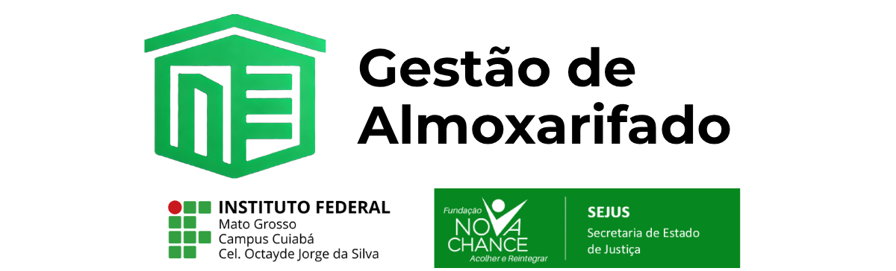

<h1 align="center">
  
</h1>

<p align="center">
  
  
  
</p>

## 📄 Descrição do Projeto
Projeto de extensão universitária desenvolvido pelos alunos do 5º semestre do IFMT Campus Cuiabá, na disciplina Oficina de Prática Extensionista. O sistema visa informatizar e otimizar processos de gestão de almoxarifado da FUNAC, instituição pública do Governo do Estado de Mato Grosso, trazendo benefícios tanto para o fluxo administrativo quanto para o desenvolvimento acadêmico dos alunos envolvidos.

## 🏛️ Contexto Institucional
- **Instituição:** IFMT Campus Cel. Octayde Jorge da Silva
- **Disciplina:** Oficina de Prática Extensionista II
- **Parceria:** FUNAC/SEJUS/MT (Fundação Nova Chance, instituição do Governo do Estado de Mato Grosso)

## 📌 Índice

<p align="center">  
  <a href="#Objetivos">Objetivos</a> •
  <a href="#Equipe">Equipe</a> •
  <a href="#Tecnologias-Utilizadas">Tecnologias</a> •
  <a href="#Funcionalidades">Funcionalidades</a> •
  <a href="#Instalação-e-Configuração">Instalação</a> •
  <a href="#estrutura-do-projeto">Estrutura</a> •
  <a href="#cronograma">Cronograma</a> •
  <a href="#Documentação">Docs</a> •
  <a href="#como-contribuir">Contribuir</a>
</p>

## 🎯 Objetivos
- **Geral:** Desenvolver um sistema que modernize a gestão de almoxarifado da FUNAC.
- **Específicos:**
  - Otimizar a gestão de almoxarifado da instituição.
  - Aplicar os conhecimentos de desenvolvimento web e banco de dados aprendidos no curso.
  - Integrar práticas reais de extensão universitária.
  - Promover benefícios institucionais para a FUNAC através da inovação tecnológica.
  - Fomentar o trabalho colaborativo entre alunos e profissionais da FUNAC.

## 👥 Equipe
- **Discentes:** Arthur Vicente, Danyllo Mendanha, Nagafe Martins, Marcos, Matheus, Vinicius Ferreira, Guilherme.
- **Docente:** Profª Esp. Heloise de Souza Bastos
- **Colaboradores:** Técnicos e gestores da FUNAC

## 💻 Tecnologias Utilizadas

Este projeto utiliza uma pilha de tecnologias moderna focada na eficiência e robustez do Django, com melhorias de interface para uma experiência de usuário ágil (SPA-like).

### Backend
- **Python 3.10+**
- **Django 5.0+:** Framework web principal.
- **Django Crispy Forms & Bootstrap 5 Pack:** Para renderização elegante e responsiva de formulários.

### Frontend
- **HTML5 & CSS3** (Estilização customizada com variáveis CSS).
- **Bootstrap 5.3:** Framework CSS para design responsivo e componentes modernos.
- **Bootstrap Icons:** Biblioteca de ícones vetoriais.

### JavaScript & Bibliotecas
- **HTMX:** Utilizado para criar buscas dinâmicas ("Search-as-you-type") e atualizações parciais de página, reduzindo a carga no servidor.
- **Chart.js:** Biblioteca para renderização de gráficos interativos no Dashboard gerencial.
- **SweetAlert2:** Substituição moderna para os `alerts` nativos, usada para confirmações de exclusão e feedback de operações.
- **IMask.js:** Aplicação de máscaras de entrada em campos (Telefones, CNPJ, Moeda).

### Banco de Dados
- **SQLite:** Padrão para desenvolvimento local.
- **PostgreSQL:** (Recomendado) Para ambiente de produção.

## 🛠️ Funcionalidades

O sistema foi desenvolvido de forma modular para atender aos requisitos de gestão da FUNAC, com foco em usabilidade e rastreabilidade.

### 📊 Dashboard Gerencial
Uma visão geral estratégica para tomada de decisão rápida.
- **KPIs (Indicadores):** Cards exibindo Valor Patrimonial Total, Total de Itens Ativos e Alertas de Reposição (Itens Críticos).
- **Gráficos:** Visualização dos Top 5 itens com maior volume em estoque via **Chart.js**.
- **Feed de Atividades:** Lista em tempo real das últimas movimentações (Entradas/Saídas) realizadas pelos usuários.

### 📦 Módulo de Itens e Fornecedores
- **Busca Dinâmica (HTMX):** Pesquisa instantânea por Código, Descrição ou Nome sem recarregar a página.
- **Feedback Visual:** Tabela de itens com indicadores coloridos (Verde/Vermelho) para status de estoque (Normal/Crítico).
- **Integridade de Dados:** O sistema impede via backend a exclusão de fornecedores que possuem itens vinculados.

### 🔄 Módulo de Movimentação e Estoque

- **Interface Intuitiva:** Seleção do tipo de operação (Entrada, Saída, Retirada, Devolução) através de *Cards Visuais* interativos, eliminando menus suspensos confusos.
- **Lógica Automática:**
  - **Entrada/Devolução:** Incrementa o saldo do item.
  - **Saída/Retirada:** Decrementa o saldo do item.
  - **Validação:** Impede saídas se o saldo for insuficiente.
- **Rastreabilidade:** Histórico completo de quem movimentou, quando e quanto.

### 🛡️ Controle de Acesso e Usuários
- **Cadastro Administrativo:** Painel exclusivo para gestores cadastrarem novos colaboradores.
- **UX de Segurança:** Campos de senha com funcionalidade "Mostrar/Ocultar" e validação de força de senha.
- **Permissões:** Uso de Decorators do Django (`@login_required`, `@permission_required`) para garantir que apenas usuários autorizados acessem áreas sensíveis.

## ⚙ Instalação e Configuração

### Pré-requisitos
- Python 3.10+
- Git

### Passo a Passo

```bash
# 1. Clone o repositório
git clone [https://github.com/ifmt-cba-laboratorio-de-software/oficinaii-api-almoxarifado.git](https://github.com/ifmt-cba-laboratorio-de-software/oficinaii-api-almoxarifado.git)

# 2. Crie e ative o ambiente virtual
python -m venv venv
# Windows:
venv\Scripts\Activate
# Linux/Mac:
source venv/bin/activate

# 3. Instale as dependências
pip install --upgrade pip
pip install -r requirements.txt

# 4. Aplique as migrações do banco de dados
python manage.py makemigrations
python manage.py migrate

# 5. Crie um superusuário (Admin)
python manage.py createsuperuser

# 6. Inicie o servidor
python manage.py runserver

almoxarifado/
├── almoxarifado/         # Configurações globais (Settings, URLs)
├── estoque/              # App Principal
│   ├── models.py         # Regras de Banco de Dados
│   ├── views.py          # Lógica de Negócio (Dashboard, CRUDs)
│   ├── forms.py          # Formulários com validação
│   ├── urls.py           # Rotas específicas do app
│   └── ...
├── templates/            # Camada de Apresentação
│   ├── base.html         # Layout Mestre (Navbar, Scripts, Footer)
│   ├── registration/     # Telas de Autenticação (Login, Signup)
│   └── estoque/
│       ├── dashboard.html       # Tela Inicial com Gráficos
│       ├── item_list.html       # Listagem com Busca HTMX
│       ├── item_form.html       # Formulário Padronizado
│       ├── movimentacao_form.html # Registro de Operações
│       └── partials/            # Fragmentos HTML para HTMX
├── static/               # Arquivos CSS, JS e Imagens
└── manage.py

📅 Cronograma

Etapa,Data,Status
Levantamento de Requisitos,31/01/2025,✅
Preparação do Ambiente,12/09/2025,✅
Desenvolvimento Backend,21/11/2025,✅
Refatoração Frontend (UI/UX),28/11/2025,✅
Testes e Validação,28/11/2025,🔄
Entrega Final,05/12/2025,⏳


## 📚Documentação
- [Requisitos do Sistema](./docs/requisitos.md)
- [Diagrama Banco de Dados](./docs/Diagramas-Banco-de-Dados.pdf)
- [Especificação técnica](.requirements.txt)

#✍️ Como Contribuir
[!CAUTION] NÃO FAÇA COMMIT NA BRANCH MAIN DIRETAMENTE.

1. Faça um fork do projeto.

2. Crie uma branch para sua feature (git checkout -b feature/nova-funcionalidade).

3. Commit suas alterações (git commit -m 'Adiciona nova funcionalidade').

4. Push para a branch (git push origin feature/nova-funcionalidade).

5. Abra um Pull Request.

> Siga o padrão de código, respeite as convenções e documente suas contribuições!

## 📜Licença 
Projeto licenciado sob BSD. Consulte o arquivo [LICENSE](./LICENSE).

## 🔄Status do Projeto


## 🤝Agradecimentos
Agradecimento especial à FUNAC pela parceria institucional, à Prof.ª Esp. Heloise de Souza Bastos pelo acompanhamento didático e ao IFMT - Campus Cuiabá pela estrutura.

---
Feito com ❤️ por discentes do IFMT.


- [Voltar ao Início](#Descrição-do-Projeto)
